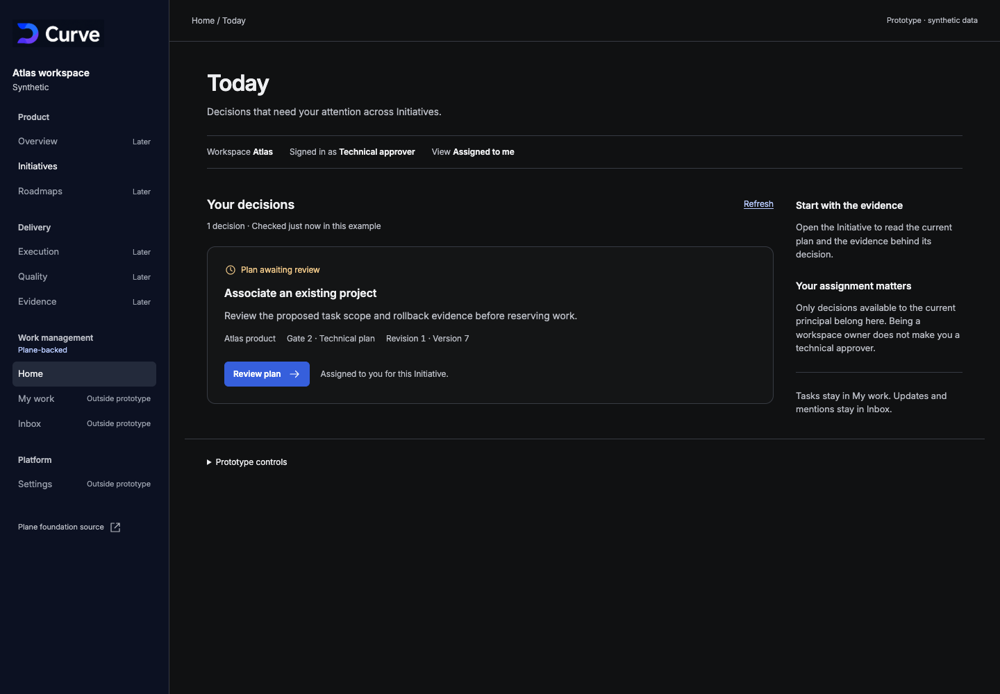

# Fede: revisión de Hoy y decisiones pendientes

**Estado: pendiente de decisión humana.** No hay integración ni nueva publicación.
La pieza revisable está fijada en `45bd773922aedcadf1256174b3104f939dba83d6`
(prototipo y evidencia local). El `ship` del revisor automático sólo avala la
pieza aislada: no sustituye estas dos aceptaciones.

## Qué podés revisar sin mirar código

[Abrir prototipo](../../apps/web/prototypes/curve-today-v1/index.html)
(recorrido sintético local, sin login ni conexión a la demo). Muestra una decisión
del aprobador técnico; **Review plan** abre el plan y su evidencia. No permite
aprobar ni reservar tareas. Prototype controls permite cambiar el principal y
simular datos parciales, desactualizados, fallidos o acceso revocado.

Captura del estado actual del prototipo (datos ficticios). También están disponibles
[vista móvil](../../apps/web/.impeccable/review/curve-today-v1/mobile.png)
(lectura y acción en pantalla estrecha) y
[plan y evidencia](../../apps/web/.impeccable/review/curve-today-v1/detail.png)
(destino de revisión con detalles desplegados).

## UX-004: decidir si el recorrido funciona

Debe probarlo una persona representativa del rol de aprobador técnico, sin ayuda
más allá de esta consigna: **“Encontrá la decisión que te corresponde, identificá
su workspace y versión, y leé el plan y su evidencia. Explicá dónde registrarías
la decisión.”** Después, con los controles del prototipo, mostrar Partial, Stale
y Access revoked: comprobar que distingue “no hay decisiones” de “no lo sabemos”,
y que entiende por qué no puede continuar.

Registrar quién lo probó, fecha, resultado y cualquier confusión. Fede puede
participar si representa ese rol; no se da por realizada la prueba por abrir una
captura ni por pasar las comprobaciones automáticas.

Opciones: **Aceptar el recorrido**, **Pedir ajustes concretos**, o **Dejar pendiente**.
Recomendación: aprobar únicamente después de esa prueba y de resolver la ubicación
indicada abajo. Cambiar la navegación materialmente requiere revisar el recorrido
actualizado antes de dar esta aceptación por cerrada.

## UX-005: decidir el alcance exacto que puede implementarse

Paquete propuesto: `LOCAL-PILOT-TODAY-G2-01` (cola de revisión técnica manual).
El [contrato de pantalla](../../apps/web/prototypes/curve-today-v1/README.md)
(fuentes, estados, accesibilidad y pruebas previstas) define este corte:

- Sólo decisiones Gate 2 disponibles para el principal y workspace actuales;
  `allowed_actions` nativo determina la acción, no la etiqueta del rol.
- Fila con Initiative, gate, revisión y versión; navegación al lector protegido
  existente. La confirmación y escritura siguen en la Initiative.
- Carga, vacío confirmado, parcial sin total, desactualizado, error, revocación y
  recuperación; teclado, foco y temas de producción antes de entregar.
- Sin autoaprobación, otros gates, métricas de productividad ni nuevas funciones
  de roadmap. La agregación autenticada y acotada aún debe diseñarse e implementarse.

**Hay una decisión de ubicación pendiente:** el prototipo hereda **Home dentro de
Work management**; el [blueprint de referencia](https://github.com/faocampo/curve/blob/af5616a5ca990f54943b7b6123c1b3362d0e6486/docs/technical/curve-experience-blueprint.md)
(arquitectura de información y criterios UX-004/005) ubica **Home en Product**.
No se considera resuelta esa diferencia por heredar la pantalla actual.

| Opción | Consecuencia |
| --- | --- |
| **Alinear la entrada con Product → Home — recomendada** | Ajustar esa navegación en el prototipo y revisar el recorrido actualizado antes de aceptar UX-004/005. Mantiene la arquitectura prevista. |
| Conservar Home actual para este corte | Registrar una excepción explícita de ubicación en la aceptación del paquete; no asumir una nueva regla global. |
| Pedir otro alcance | Describir el cambio y actualizar prototipo, contrato y pruebas antes de aceptar. |

Aceptar UX-005 habilita el paquete para implementación una vez resuelto el recorrido;
no autoriza publicación, despliegue, acceso a datos reales ni cierre operativo.

## Respuesta mínima

1. **Ubicación y alcance:** opción recomendada, excepción de Home actual, o ajustes.
2. **Resultado UX-004:** participante, tarea realizada sin ayuda sí/no y aceptar /
   ajustes / pendiente. Si se cambia la ubicación, completar sobre la pieza actualizada.

No hace falta revisar código ni enviar contraseñas. Los registros exactos de
aceptación quedarán ligados a la pieza final, al paquete y a sus pruebas; mientras
no existan, ambos gates siguen pendientes.

## Qué no requiere esa autorización y qué se decide por separado

Ya se puede implementar y probar con copias sintéticas: persistencia, reinicio,
restauración, fallos, permisos, limpieza y observabilidad local. No se necesita
invitar personas ni activar conexiones para esas pruebas.

Antes de un piloto con participantes reales habrá que confirmar el grupo privado,
cuentas individuales, roles por Initiative, riesgo y posibles excepciones;
operador, almacenamiento, retención y procedimiento de recuperación. Cualquier
IdP, proveedor, recurso privado o conexión real exige su autorización y acceso
vigentes. No se crean credenciales ni se interpretan los usuarios sintéticos como
personas verificadas. Esas decisiones operativas no se obtienen al aceptar UX.
